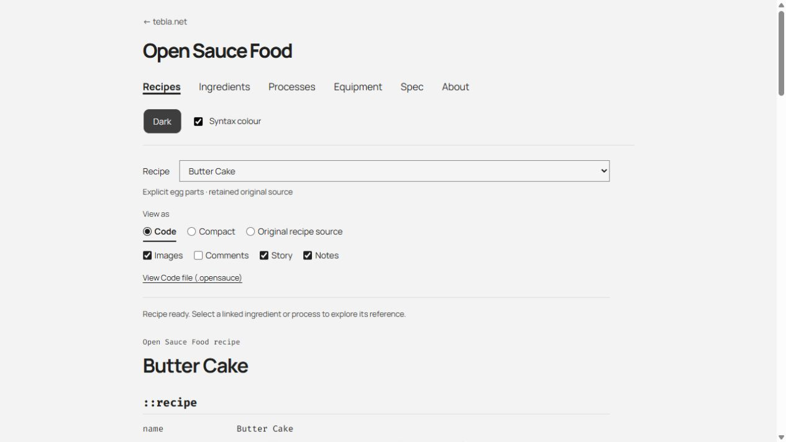

# Open Sauce Food

**Open Sauce Food is in early development.**

Open Sauce Food is a human-readable recipe language and shared culinary knowledge base,
designed for personal recipe collection, versioning, remixing and collaboration.

Recipes are plain-text `.opensauce` files that people can read and edit directly.
The authored `.opensauce` representation is **Code**, the primary/default view.
**Compact** is a condensed human-readable rendering generated from Code.
**Original recipe source** is preserved upstream provenance where available, not
another rendering of Code. The parser preserves authored text. Shared culinary
knowledge lives separately in YAML. Git remains the source of truth for recipe
and vocabulary history.

The aim is to make a recipe useful both in a text editor and in software: follow an
ingredient to its reference page, distinguish a part from a whole, review a change,
or keep your own version without depending on a particular website. This is a
human recipe format, not a robot-execution language.

A browsable alpha is **planned** for `tebla.net/opensaucefood/`. For now, run the
local prototype below. See [licensing](LICENSING.md) and the remaining
[publication setup](RELEASE-CHECKLIST.md).

## A small example

A preparation fragment illustrating the syntax, rather than a complete cooked dish:

```opensauce
::recipe
name: Dough preparation

::ingredients
(flour; plain) 250g
(egg: yolk) 2

::equipment
(mixing bowl)

::instructions
{dough} = (flour) + (egg: yolk)
{dough} <mix, mixing bowl>
    <rest, 20m>
```

The current Compact renderer produces these instructions:

> Combine flour and egg yolk to make dough.
> Mix the dough in the mixing bowl, then rest for 20 minutes.

The original spelling and structure remain available; rendering does not rewrite
the recipe. Natural language is still welcome wherever stricter structure would
add little value.

See [recipe representations](TERMINOLOGY.md) for the API and provenance distinction.

## Current status

Draft 8 is implemented and experimental. Checked against the repository on
8 October 2026:

- **410 recipes**, with **756 canonical vocabulary entries**: 433 ingredients,
  119 equipment entries and 204 processes.
- A source-preserving TypeScript parser, Code/Compact renderers, safe
  HTML rendering, and literal Original recipe source view when an original is embedded.
- Explicit variants and parts, quantity precision, groups, notes, story, comments
  and image visibility controls.
- Ingredient, equipment and process reference pages with corpus usage links;
  independent origin/review [curation metadata](CURATION.md).
- A local Tebla-derived light/dark prototype with six semantic colours: ingredient
  green, equipment blue, part/type yellow, process red, result purple, value orange.
  Light mode uses marker fills; dark mode uses coloured text. Colour can be disabled.

All 410 recipes parse without errors. **Parser success is not culinary verification.**
The 293 most recently converted encodings are explicitly `generated / unchecked`.
Older encodings may have no curation metadata; absence means unknown, not reviewed.
The corpus still contains ambiguous references, free text and conversion issues.
The knowledge base is sparse; quantity conversion, scaling and automatic dietary
reasoning are not implemented. Numeric knowledge modules have schema support,
not a populated nutrition or conversion database.



[Dark-mode recipe preview](docs/visual-review/code-dark-current.jpg) ·
[Historical ingredient reference preview](docs/visual-review/egg-dark.jpg)

## Try it locally

Requires **Node.js 24+** and **pnpm** (the lockfile uses pnpm's version 9 format).
From the repository root:

```sh
pnpm install --frozen-lockfile
pnpm demo
```

Open `http://127.0.0.1:4173/` on your own machine. This is a local development
server, not the public alpha. `PORT` can select another port.

Choose a recipe, switch Code / Compact / Original recipe source, or follow a resolved
term to a reference page. The current navigation opens representative reference
entries; complete browsable indexes are planned. The package remains private in
`package.json`; no published npm package is implied.

```sh
pnpm check
pnpm build
pnpm test
pnpm corpus
```

See [Core API and setup](CORE.md) and [HTML renderer](HTML-RENDERER.md).

## Syntax at a glance

| Form | Meaning |
|---|---|
| `(thing)` | Ingredient or equipment, distinguished by declaration context/resolution |
| `(base; variant)` | Explicit type, such as `(flour; plain)` |
| `(base: part)` | Local part, such as `(egg: yolk)` |
| `{result}` | Named intermediate or result |
| `<process, parameter>` | Action and optional human-readable parameters |
| `[ ... ]` | Grouped instruction block |
| `+` / `=` | Combine/add / define or assign a result |
| `/` | Equivalent quantity or setting, not an instruction to divide |
| `-OR-` | Alternative |
| `Meanwhile [ ... ]` | Parallel/overlapping block |
| `Optional [ ... ]` | Optional block |
| `Repeat [ ... ]` | Repeated block, with a condition where supplied |
| `::ingredients`, `::equipment`, `::instructions` | Section markers; also recipe metadata, story, notes and original source |
| `# comment` | Comment outside an opaque source payload |

Precision belongs to the **quantity expression**: `!100g` means measure closely,
`~100g` approximate, and `~~100g` very approximate. Future conversions must not
manufacture precision. Loose comma qualifiers, such as `(butter, room temperature)`,
are not automatically variants or parts.

Full rules: [Draft 8 specification](SPEC.md), [Draft 8 changes](DRAFT8-CHANGES.md)
and [known implementation questions](IMPLEMENTATION-ISSUES.md).

## Shared culinary knowledge

**Minimise concepts, not vocabulary.** Authored recipe text and canonical knowledge
are separate layers. Authors keep their words; explicitly accepted aliases and
regional names can resolve to one concept without changing the source.

Current YAML examples include [courgette / zucchini](ingredients/courgette.yaml),
[egg: yolk](ingredients/egg.yaml), [flour variants](ingredients/flour.yaml),
[garlic: clove](ingredients/garlic.yaml), and
[chicken: breast / thigh](ingredients/chicken.yaml). Parts are local relationships,
not global synonyms for the whole ingredient. Distinct culinary concepts are not
merged merely because their names look similar.

Vocabulary can improve independently of recipe text. Unresolved vocabulary does
not invalidate an otherwise valid recipe; unresolved is preferable to a wrong
canonical match. Entries can carry origin/review metadata, and missing metadata
means unknown. Read the [knowledge schema](VOCABULARY-SCHEMA.md) and the
[first vocabulary-review report](VOCABULARY-REVIEW.md) for current limits.

## Corpus and provenance

The current corpus comes from **Public Domain Recipes**, pinned to upstream commit
`da84378b36bd5b2e3cb35f610d64630bf1bd899d`. It combines 117 earlier examples with
293 generated conversions. Original Markdown, metadata, hashes and available
images are retained for audit; many originals are also embedded in `::source`.

Upstream declares its text and images public domain under the Unlicense. That is
recorded evidence, not a blanket clearance of every cited third-party source.
Five provenance-review cases are excluded from this public distribution, including
three formerly promoted encodings and two previously held originals. Their text,
metadata and assets are absent; only a compact exclusion record is public.

[Data sources and licence boundaries](DATA-SOURCES.md) explain the import,
source preservation, image considerations and outstanding review. Source provenance
and the curation status of an Open Sauce Food encoding are different things.

## Git, remixing and collaboration

Plain text makes changes visible in normal diffs. Recipes can be forked and remixed,
with ordinary Git commits recording their history. Knowledge improvements can be
reviewed independently from recipe edits. Future personal repositories should be
able to use or extend shared vocabulary while retaining their own authorship and
history; that distribution workflow is still to be designed.

A future **Open Sauce Food Index is not the source of truth**. It would provide optional
discovery, while Git repositories continue to own recipe/version history.

## Repository map

| Area | Contents |
|---|---|
| [src/parser](src/parser/), [src/model](src/model/), [SPEC.md](SPEC.md) | Authored language implementation and model/specification |
| [src/renderer](src/renderer/) | Code, Compact and HTML presentation |
| [ingredients](ingredients/), [equipment](equipment/), [processes](processes/) | Indexed canonical YAML knowledge |
| [src/vocabulary](src/vocabulary/), [src/reference](src/reference/) | Lookup and reference-page generation |
| [examples/public-domain-recipes](examples/public-domain-recipes/) | Imported/converted corpus and available recipe images |
| [source/public-domain-recipes](source/public-domain-recipes/) | Retained upstream sources, notices and provenance evidence |
| [vocabulary-raw](vocabulary-raw/) | Historical observations, not canonical resolution rules |
| [demo](demo/), [tests](tests/), [scripts](scripts/) | Local UI, automated checks and import/report tooling |
| [docs](docs/), root reports | Documentation index, previews and intentionally retained audit reports |

## Related work

[Cooklang](https://cooklang.org/docs/) is an established plain-text recipe language
and ecosystem. Open Sauce Food explores explicit things/processes/results and a shared
canonical knowledge layer with local variants and parts. Plain text and Git are
shared values, not claims of uniqueness. See [Prior art](PRIOR-ART.md) for the
comparison, ontology connections and the separate naming overlaps with
opensauce.com and Open Sauce Recipes.

## Planned / future work

These are directions, not implemented features or delivery promises:

- **Language and rendering:** output relationships, clearer process roles, better
  Compact phrasing and source-preserving review/editing tools.
- **Knowledge:** contextual defaults, richer parts/groups, sourced mass/density and
  nutrition, defensible fuzzy quantities and substitutions.
- **Cooking:** exact and ingredient-dependent approximate conversions, scaling,
  localisation, richer dietary handling and step-focused presentation.
- **Publishing:** the Tebla alpha, recipe/category and reference indexes; later,
  optional discovery, stable IDs/lineage and linked personal repositories.
- **Interoperability:** possible Cooklang and RDF/ontology exports, preserving
  Git-first and offline use.

The [roadmap](ROADMAP.md) separates existing foundations, the first alpha and later
possibilities, including external data links and optional social signals.

## Planned Tebla alpha

The intended first web release at `tebla.net/opensaucefood/` is a browsable
language/corpus demonstration, labelled **“Open Sauce Food is in early development”**
and linking back to GitHub. It should include a recipe index, browsing by existing
category metadata, ingredient/process/equipment indexes, and Spec/About pages.
Accounts, ratings and community/index machinery are not prerequisites. This README
does not announce a live deployment.

## Contributing

Recipe fixes, deliberate reviews, aliases, parts/variants, renderer improvements,
documentation and provenance corrections are all useful. Start with
[CONTRIBUTING.md](CONTRIBUTING.md). Small, evidenced changes are easier to review
than bulk canonicalisation. Language changes need a concrete recipe case and an
explicit discussion; do not silently change the grammar.

## Licensing

Original tooling is MIT; the demo presentation is GPL-2.0-or-later; project-owned
canonical data is CC0 1.0; authored documentation/specification and encoding expression
are CC BY 4.0. Imported sources and OFL fonts retain their own terms. See
[LICENSING.md](LICENSING.md) for exact boundaries, attribution and exceptions.

## Development and attribution

**Concept and design**

Open Sauce Food's core concept, recipe-language design, syntax, culinary knowledge
model and product direction were developed by Tebla.

**Implementation**

The parser, renderers, reference-site prototype and much of the supporting tooling
were implemented with substantial assistance from OpenAI Codex, under Tebla's
direction and review.

**Development process**

Design decisions, prompts, testing, review and acceptance were human-directed;
generated implementation work was reviewed and iterated within the project.

See [publication setup](RELEASE-CHECKLIST.md), [data sources](DATA-SOURCES.md), and
[the documentation/report index](docs/README.md).
