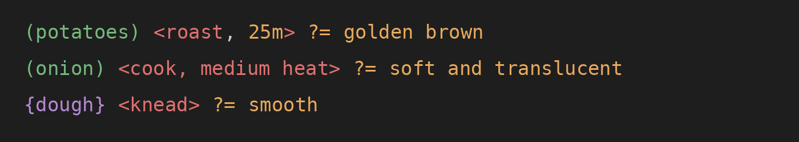
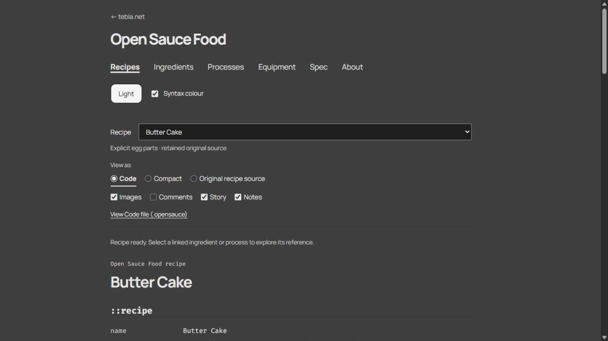

Documentation note: The current documentation is provisional and largely placeholder text from the initial development/release process. I plan to rewrite the public-facing docs as the project settles.


# Open Sauce Food

**Open Sauce Food is in early development.**

Open Sauce Food is a human-readable recipe language and shared culinary knowledge base, designed for personal recipe collection, versioning, remixing and collaboration.

Recipes are written in **Sauce Code**, using plain-text `.opensauce` files. The idea is that Sauce Code should still look enough like a recipe that you can read and edit it directly, while giving software enough structure to understand ingredients, equipment, actions, results, alternatives and other useful relationships.

A small piece of Sauce Code looks like this:

```opensauce
::recipe
name: Dough preparation

::ingredients
(flour; plain) 250g
(egg: yolk) 2

::equipment
(mixing bowl)

::instructions
{dough} = (flour) + (egg: yolk)
{dough} <mix, in (mixing bowl)>
    <rest, 20m>
```

One of the main reasons for Sauce Code is simple: for some people — sample size currently at least one — it can be faster to read a recipe this way than to parse the same instructions from ordinary prose.

Ingredients, actions, results, alternatives and end states are visually distinct, so the useful structure is there at a glance instead of being hidden inside sentences.

The punctuation is deliberately visual. The browser uses six semantic colours; the coloured squares below mirror them in a way that also survives on GitHub:

| Colour | Sauce Code | Meaning |
|---|---|---|
| 🟩 | `(flour)` | Ingredient |
| 🟦 | `(mixing bowl)` | Equipment |
| 🟨 | `(flour; plain)` / `(egg: yolk)` | Variant or part |
| 🟥 | `<mix>` | Process / action |
| 🟪 | `{dough}` | Something made during the recipe |
| 🟧 | `20m` | Value |
| 🟧 | `?= golden brown` | Cook-judged end state |

One especially useful bit of Sauce Code is `?=`. It means **“judge this action complete when…”**:



The time, temperature or other setting belongs to the action; `?=` records the state a cook is actually looking for. That distinction is useful both to people and to software, and avoids hiding an important endpoint inside free prose like “cook until done”.

The rest of the grammar stays mostly neutral:

| Form | Meaning |
|---|---|
| `+` | Add / combine |
| `=` | Define or assign |
| `-OR-` | Alternative |
| `/` | Equivalent quantity or setting |
| `!100g` | Measure closely |
| `~100g` | Approximate |
| `~~100g` | Very approximate |
| `[ ... ]` | Grouped instruction block |
| `Meanwhile [ ... ]` | Overlapping work |
| `Optional [ ... ]` | Optional block |
| `Repeat [ ... ]` | Repeated block |
| `# comment` | Maintainer/import/commentary comment |
| `::ingredients`, `::equipment`, `::instructions` | Sections |

Precision belongs to the quantity expression rather than being guessed from prose. The full rules are in the [Draft 8 specification](SPEC.md).



## Code, Compact and the original recipe

**Open Sauce Food** is the wider project. **Sauce Code** is the language itself.

The authored `.opensauce` representation is the main version of a recipe. On the site this is shown as **Code**.

**Compact** is generated from that Code. It is there for reading, not as a second source of truth.

Where an imported recipe has an upstream source, **Original recipe source** preserves that provenance separately. It is not another rendering of the Sauce Code.

For example, the fragment above can be rendered into something more like ordinary instructions:

> Combine flour and egg yolk to make dough.
> Mix the dough in mixing bowl, then rest for 20 minutes.

The original spelling and structure of Sauce Code are preserved; rendering does not rewrite the recipe. Natural language is also allowed where forcing more structure would make the recipe worse rather than better.

See [recipe representations](TERMINOLOGY.md) for the API and provenance distinction.

## Why structure recipes at all?

Recipes already contain a lot of structure, but most of it is normally buried in prose.

Open Sauce Food tries to make useful parts of that structure explicit without turning a recipe into a robot-execution language. Software can tell that an egg yolk is part of an egg, that dough is something created during the recipe, that two methods are alternatives, or that an instruction is referring back to a previously selected ingredient or piece of equipment.

That makes some useful things possible while keeping the underlying recipe as plain text:

- ingredients, equipment and processes can link to shared reference pages;
- changes are visible in ordinary Git diffs;
- recipes can be forked and remixed without depending on one website;
- shared culinary knowledge can improve separately from the wording of individual recipes;
- a recipe can be rendered differently without throwing away the authored version.

The shared knowledge lives separately in YAML. Git remains the source of truth for recipe and vocabulary history.

## A good recipe and good Sauce Code are different things

Open Sauce Food separates **the quality of a recipe** from **the quality of its representation**.

A delicious recipe can have ugly or ambiguous Sauce Code. A terrible recipe can be represented beautifully.

That means a recipe can be improved as Sauce Code without changing how the food is made. Splitting an overloaded action, making an alternative explicit, naming a useful intermediate result, fixing a reference or moving serving advice into notes can all be worthwhile changes even when the ingredients and method stay exactly the same.

Conversely, a representation cleanup should not quietly “fix” a strange recipe just because the author would have cooked it differently.

This distinction is especially important for reviews and pull requests: **encoding-only changes should preserve culinary meaning**. Changes to the actual recipe are a different kind of edit.

## Shared culinary knowledge

One of the broader aims of Open Sauce Food is a shared culinary knowledge layer that recipes can refer to without forcing every author to use exactly the same words.

The working principle is:

> **Minimise concepts, not vocabulary.**

Authors can keep regional names, aliases and useful local wording while those names resolve to shared concepts where the relationship is known.

For example, the knowledge base can understand things such as:

- courgette / zucchini;
- regional process names can overlap in both directions: the same technique can have different names in different places, and the same word can mean different techniques. For example, US **broil** roughly overlaps with UK **grill**, while US **grill** usually means something closer to UK **barbecue**.
- egg → yolk / white / shell;
- plain flour as a flour variant;
- garlic → clove;
- chicken → breast / thigh.

Parts are relationships, not global synonyms. Distinct culinary concepts are not merged just because their names look similar, and an unresolved term is preferable to confidently resolving it to the wrong thing.

Vocabulary can improve independently of recipe text. Entries can also carry origin and review metadata. See the [knowledge schema](VOCABULARY-SCHEMA.md) and [vocabulary review](VOCABULARY-REVIEW.md).

## Current status

Draft 8 is implemented and experimental.

The current repository contains **410 recipes** and **709 canonical vocabulary entries**: 386 ingredients, 119 equipment entries and 204 processes.

The project currently includes:

- a source-preserving TypeScript parser;
- Code, Compact and HTML renderers;
- explicit variants and parts;
- results and inherited instruction subjects;
- qualitative judgements with `?=`;
- alternatives, `Meanwhile`, `Optional` and `Repeat` blocks;
- structured ingredient/equipment references inside process context;
- story, notes, comments and source preservation;
- ingredient, equipment and process reference pages with published-recipe usage links;
- independent origin/review [curation metadata](CURATION.md);
- light and dark presentation using the six semantic colours shown above.

The recipe corpus is uneven. All 410 recipes parse without errors, but they are not all at the same level of Sauce Code quality. **Parser success is not culinary verification, and it is not proof that a recipe has been represented well.**

The development corpus contains **410 recipes**. Explicit `conversion stage` metadata selects **216 reworked recipes** for normal public browsing: 34 earlier accepted rewrites and 182 accepted deep rewrites. **184 initial** and **10 blocked** recipes remain in the repository, with direct development pages marked noindex and omitted from public discovery and reference backlinks.

The six historical reference examples were re-audited against current structural expectations; all six currently need further work and are classified initial. “Gold” is not a current quality tier or publication qualification. Conversion maturity is independent of human curation/review. See [recipe publication](RECIPE-PUBLICATION.md) for the model and decisions.

The quality audit findings help locate and prioritise likely problems. They are not correctness scores and do not replace recipe-by-recipe judgement. Much of this work is generated; a later rewrite does not by itself establish deliberate human review.

The knowledge layer is also deliberately incomplete. Quantity conversion, scaling, automatic dietary reasoning and a populated nutrition/density database are not finished features yet.

A browsable alpha is live at **https://tebla.net/opensaucefood/**.

[Light-mode Sauce Code preview](docs/visual-review/code-light-current.jpg) ·
[Historical ingredient reference preview](docs/visual-review/egg-dark.jpg)

## Corpus and provenance

The current corpus comes from **Public Domain Recipes**, pinned to upstream commit `da84378b36bd5b2e3cb35f610d64630bf1bd899d`.

Original Markdown, metadata, hashes and available images are retained for audit; many originals are also embedded in `::source`.

Upstream declares its text and images public domain under the Unlicense. That is recorded evidence, not a blanket clearance of every cited third-party source. Five provenance-review cases are excluded from this public distribution; their text, metadata and assets are absent and only a compact exclusion record is public.

[Data sources and licence boundaries](DATA-SOURCES.md) explain the import, source preservation, image considerations and outstanding review. Source provenance and the curation status of an Open Sauce Food encoding are separate things.

## Git, remixing and collaboration

Plain text makes changes visible in normal diffs. Recipes can be forked and remixed, with ordinary Git commits recording their history.

Knowledge improvements can be reviewed independently from recipe edits. In future, personal repositories should be able to use or extend shared vocabulary while keeping their own authorship and history.

A future **Open Sauce Food Index would not be the source of truth**. It could provide discovery, while Git repositories continue to own recipe and version history.

## Repository map

| Area | Contents |
|---|---|
| [src/parser](src/parser/), [src/model](src/model/), [SPEC.md](SPEC.md) | Sauce Code implementation, model and specification |
| [src/renderer](src/renderer/) | Code, Compact and HTML presentation |
| [ingredients](ingredients/), [equipment](equipment/), [processes](processes/) | Canonical culinary knowledge |
| [src/vocabulary](src/vocabulary/), [src/reference](src/reference/) | Lookup and reference-page generation |
| [examples/public-domain-recipes](examples/public-domain-recipes/) | Imported/converted recipe corpus and available images |
| [source/public-domain-recipes](source/public-domain-recipes/) | Retained upstream sources, notices and provenance evidence |
| [vocabulary-raw](vocabulary-raw/) | Historical observations, not canonical resolution rules |
| [demo](demo/), [tests](tests/), [scripts](scripts/) | UI, automated checks and import/report tooling |
| [docs](docs/), root reports | Documentation, previews and retained audit reports |

## Current contribution focus

Open Sauce Food is in an early design phase. Sauce Code, the knowledge model and data structures are still changing quickly, so small recipe fixes, isolated YAML additions and bulk data curation are not the priority yet.

Design discussion is especially welcome: the overall shape of the project, syntax and semantics, ingredient/process/equipment modelling, recipe representation and provenance, reference knowledge, substitutions, dietary adaptation, rendering and planned features. Concrete edge cases help.

Please open an issue or discussion before doing substantial data work. Once the foundations settle, individual recipe fixes, vocabulary additions and knowledge-data contributions will become much more useful.

See [CONTRIBUTING.md](CONTRIBUTING.md).

## Related work

[Cooklang](https://cooklang.org/docs/) is an established plain-text recipe language and ecosystem. Open Sauce Food explores somewhat different choices around explicit things/processes/results and a shared canonical knowledge layer with local variants and parts.

Plain text and Git are shared values, not claims of uniqueness.

See [Prior art](PRIOR-ART.md) for the comparison, ontology connections and the separate naming overlaps with opensauce.com and Open Sauce Recipes.

## Where this might go

These are directions rather than promises:

- **Language and rendering:** output relationships, clearer process roles, better Compact phrasing and source-preserving review/editing tools.
- **Knowledge:** better canonicalisation, richer ingredient/equipment/process data, sourced mass/density and nutrition, useful substitutions and contextual defaults.
- **Cooking:** exact and ingredient-dependent approximate conversions, scaling, localisation, richer dietary handling and step-focused presentation.
- **Publishing:** better recipe/category/reference browsing, then optional discovery, stable IDs/lineage and linked personal repositories.
- **Interoperability:** possible Cooklang and RDF/ontology exports while preserving the Git-first/offline model.

The [roadmap](ROADMAP.md) separates existing foundations from later possibilities.

## Licensing

Original tooling is MIT; the demo presentation is GPL-2.0-or-later; project-owned canonical data is CC0 1.0; authored documentation/specification and encoding expression are CC BY 4.0.

Imported sources and OFL fonts retain their own terms. See [LICENSING.md](LICENSING.md) for exact boundaries, attribution and exceptions.

## Development and attribution

**Concept and design**

Open Sauce Food's core concept, Sauce Code language design, syntax, culinary knowledge model and product direction were developed by Tebla.

**Implementation**

The parser, renderers, reference-site prototype and much of the supporting tooling were implemented with substantial assistance from OpenAI Codex, under Tebla's direction and review.

**Development process**

Design decisions, prompts, testing, review and acceptance were human-directed; generated implementation work was reviewed and iterated within the project.

See [publication setup](RELEASE-CHECKLIST.md), [data sources](DATA-SOURCES.md), and [the documentation/report index](docs/README.md).

### Optional recipe classification

Classification adds optional capabilities: a minimal recipe remains valid without
`category`, `dietary`, `cuisine` or `region`. These fields are independent of
`conversion stage`, `curation origin` and `curation review`.

```text
category: main
dietary: vegan, nut-free
cuisine: italian
region: sicily
```

- `category` is one broad culinary role: `drink`, `bread/baking`,
  `preserve/ferment`, `soup/stew`, `main`, `dessert`, `side`, `starter`, `sauce/seasoning/stock`,
  `snack`, `breakfast`, or `miscellaneous`. Multiple values are not supported. Invalid, empty or duplicate
  declarations produce a warning and no resolved category; raw text is retained.
  Soups, chowders, broths-as-dishes and stews use `soup/stew`, regardless of
  portion size. Reserve `starter` for clearly appetiser/first-course dishes that
  are not primarily soup or stew.
  `sauce/seasoning/stock` covers sauces, dressings, dips, spreads, relishes,
  condiments, spice mixtures, dry rubs, seasoning blends, stocks, cooking-base
  broths and similar prepared components used with or in another dish.
  `miscellaneous` is a deliberately small residual category for preparations
  without a defensible fit elsewhere. Prefer a meaningful specific category;
  substantial growth of miscellaneous would suggest another real category is needed.
- `dietary` is an extensible comma-separated list of author-supplied labels, such
  as `vegan`, `vegetarian`, `nut-free`, `gluten-free` or `dairy-free`. Values are
  trimmed, exact duplicates removed in first-seen order, and repeated lines
  combined in source order. Empty entries produce a warning and no resolved list.
  There is no controlled dietary vocabulary or inference in this version.
- `cuisine` and `region` are optional single plain-text values with no controlled
  vocabulary. Non-empty arbitrary strings are accepted. Empty or duplicate
  declarations warn and leave the resolved field absent.

Dietary labels are author-supplied and are not a guarantee of suitability. Check
ingredients, substitutions and product labels for your own dietary requirements.
They are advisory, not certification. HTML dietary displays include this advice.

Corpus categories are provisional best-effort guesses of a primary role and can
be corrected. Some preparations do not fit these broad roles and may remain
uncategorised. Category discovery includes only `reworked` recipes; hidden direct
pages retain their own metadata. These labels do not change publication or review
status. No corpus-wide dietary, cuisine or region inference has been performed.
